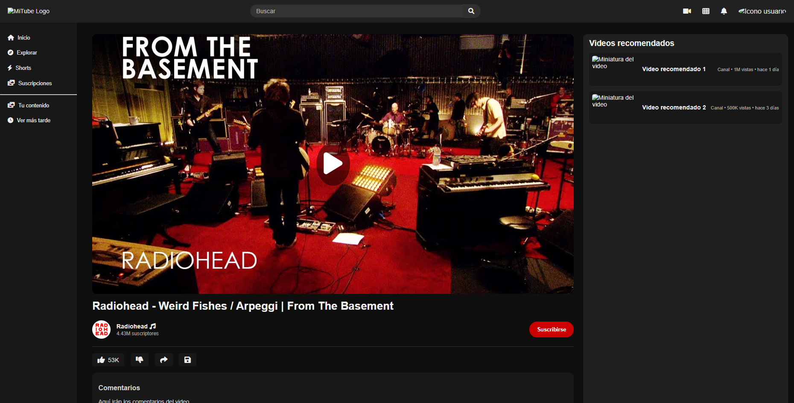

# 🎬 NekoTube

Bienvenido a **NekoTube**, una plantilla inspirada en YouTube que permite visualizar videos, simular canales, comentarios y más. Ideal como base para un proyecto de plataforma de video personalizada.

👉 **[Ver sitio en vivo](https://nachito182.github.io/Plantilla-NekoTube/)**

---

## 📸 Vista previa

---

## 🚀 Características

- Reproductor de video estilo YouTube (con miniatura inicial y botón de reproducción).
- Sección de videos recomendados a la derecha.
- Zona de comentarios.
- Botones de interacción: Me gusta, No me gusta, Compartir, Guardar.
- Información del canal y botón de suscripción.
- Barra de navegación fija con logo, barra de búsqueda y perfil de usuario.
- Diseño responsivo y estilizado en modo oscuro.

---

## 🛠️ Tecnologías utilizadas

- HTML5
- CSS3
- JavaScript (Vanilla)
- Font Awesome (para iconos)
- GitHub Pages (para despliegue)

---